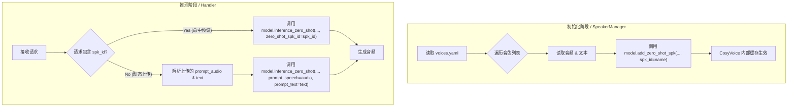

**Role:** Senior Python Developer / Audio AI Architect
**Task:** 扩展 LightTTS 框架，基于 `voices.yaml` 配置文件实现 CosyVoice2 的 `zero_shot_spk_id` 预加载与推理功能。

**CRITICAL INSTRUCTIONS (必须严格遵守):**

1. **API Usage:** 你**必须**且**只能**使用 CosyVoice 官方提供的以下两个高层 API，严禁手动去 hack 或重新实现特征提取逻辑：
* 注册时：`model.add_zero_shot_spk(prompt_text, prompt_speech, spk_id)`
* 推理时：`model.inference_zero_shot(tts_text, prompt_text, prompt_speech_16k, stream=..., speed=..., zero_shot_spk_id=...)`


2. **Code Analysis:** 请仔细阅读我提供的代码文件。不要重写整个文件，而是要识别出模型初始化的位置和推理请求处理的位置。
3. **Decoupling:** 请将配置加载和音色注册逻辑封装在一个独立的模块或类中（例如 `SpeakerManager`），保持主 `TTSHandler` 代码的整洁，不要把 YAML 解析逻辑散落在推理循环里。

**Logic Flow (逻辑视图):**
请参考以下逻辑流进行代码设计：



**Input Data (`voices.yaml`):**

```yaml
voices:
  - name: female
    audio_path: assets/wangye1.mp3
    prompt_text: "使用费的话，这一块是属于你管品牌就三万块钱。培训的话，培训费要两万。"
  - name: female_long
    audio_path: assets/wangye1.wav
    prompt_text: "使用费的话，这一块是属于你管品牌就三万块钱。培训的话，培训费要两万，然后设计费要三千，然后系统使用费要两两千块钱这样子。那这一次的话就是今年我们加盟它，这些都是减免的。"
  - name: male
    audio_path: assets/xiangyu.mp3
    prompt_text: "咱们这个项目呢，属于是投入低、回本快。而且现在加盟呢，还有一些政策上的这个优惠。"

```

**Implementation Details:**

1. **加载逻辑:** 在模型加载后，立即调用 `SpeakerManager` 读取 YAML 并循环执行 `add_zero_shot_spk`。
2. **推理参数:** 在调用 `inference_zero_shot` 时，请注意：
* 如果使用了 `zero_shot_spk_id`，则 `prompt_speech_16k` 和 `prompt_text` 参数应设为 `None` (或者根据官方 API 要求处理，通常 ID 优先级更高)。
* 不要忘记传递 `stream`、`speed` 等其他控制参数。


3. **错误处理:** 如果用户传入的 `spk_id` 不在 YAML 定义的范围内，应回退逻辑或抛出明确错误。
